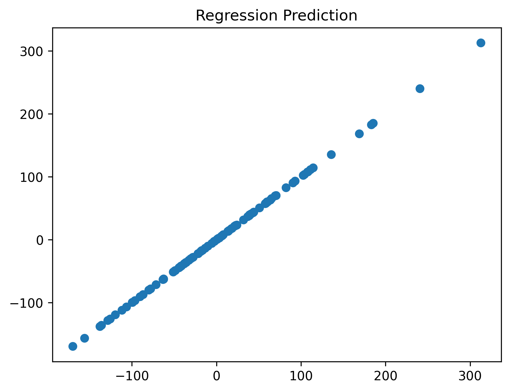

# SmartReport: "Linear

**Run ID:** `8202878551`  
**Timestamp:** 25.07.2025 00:00  
**Duration:** 0.02 s  

## Code Snippet
from sklearn.datasets import make_regression
from sklearn.linear_model import LinearRegression
from sklearn.metrics import mean_squared_error

X, y_true = make_regression(n_samples=100, n_features=3, noise=0.2, random_state=42)
model = LinearRegression().fit(X, y_true)
y_pred = model.predict(X)

import matplotlib.pyplot as plt
plt.figure()
plt.scatter(y_true, y_pred)
plt.title("Regression Prediction")

print("MSE:", mean_squared_error(y_true, y_pred))

## Metrics
| name | value |
|------|------:|

| y_mse | 0.0395 |

| y_r2 | 1.0000 |

## Figures

## Stdout
MSE: 0.03952992403106014

